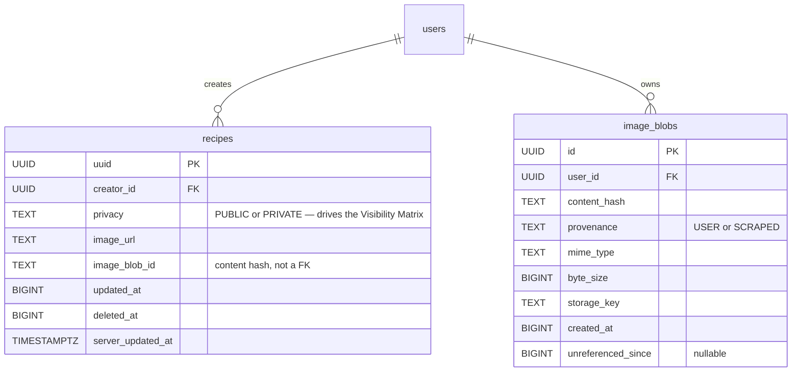
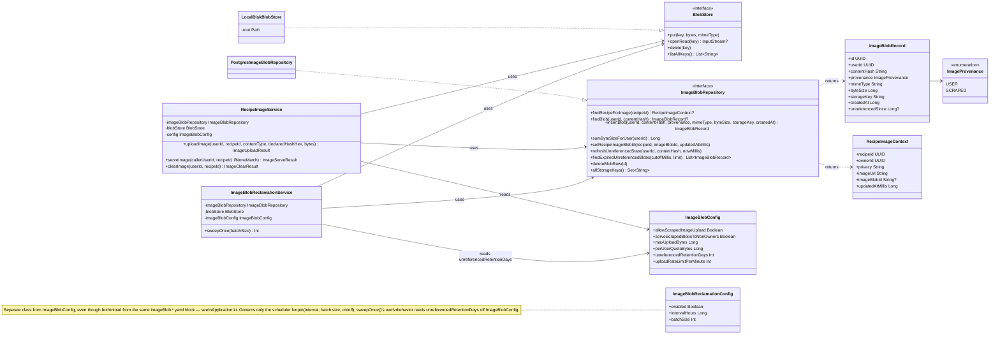
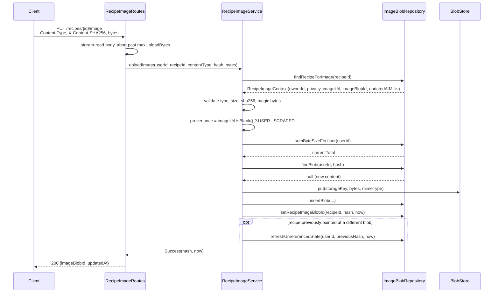
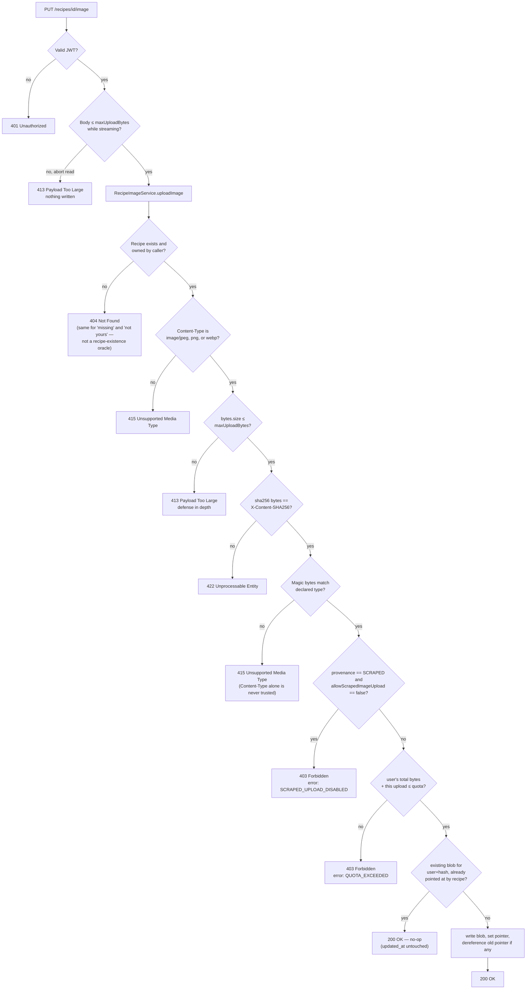
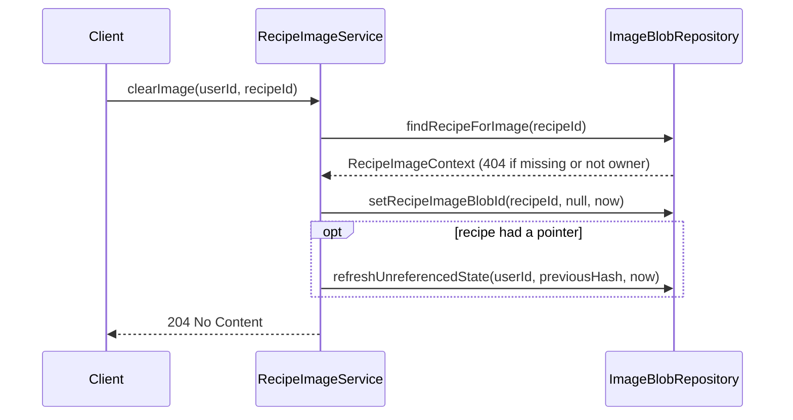
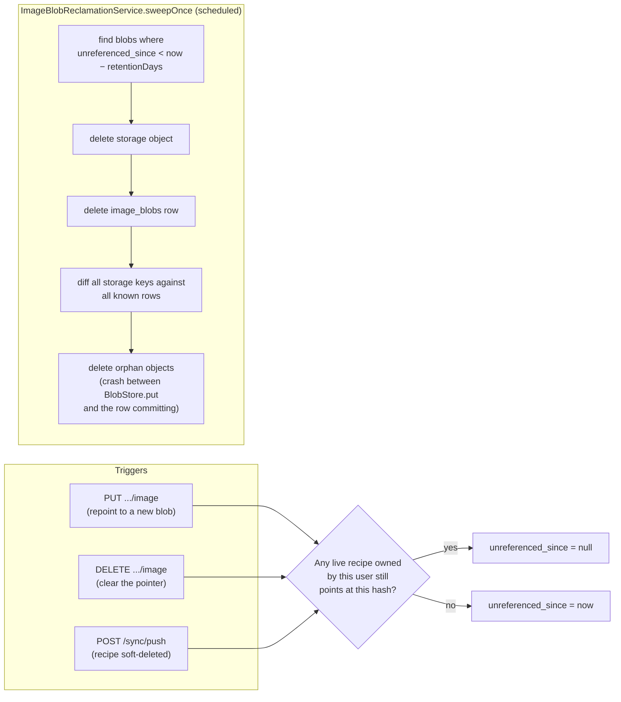
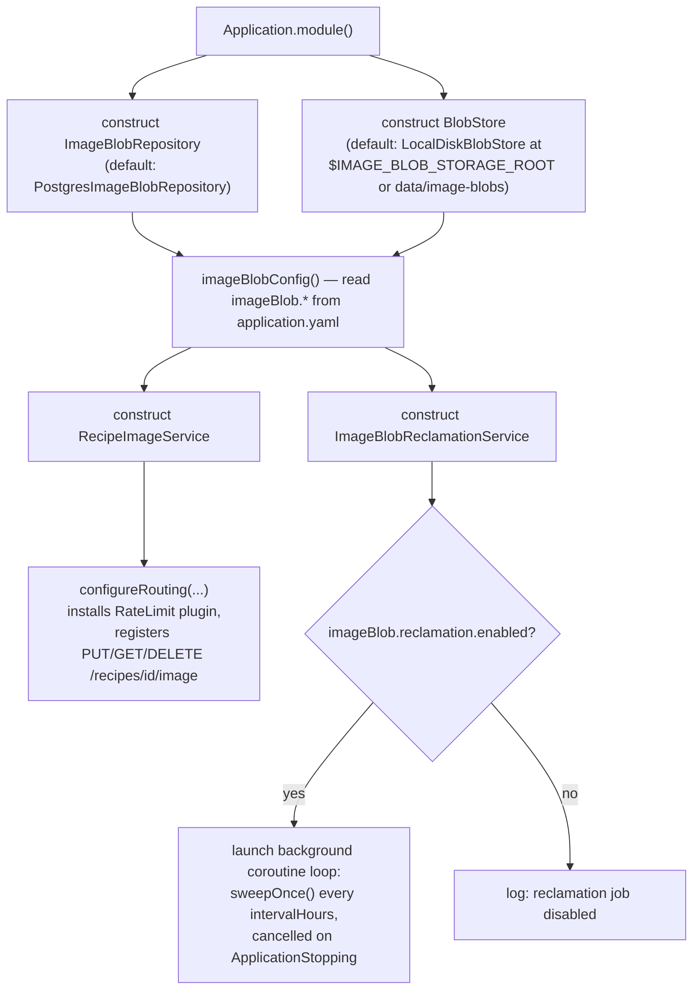

# Recipe Image Blob Architecture

## Table of Contents

1. [Architecture Overview](#architecture-overview)
2. [Data Model](#data-model)
3. [Class Diagram](#class-diagram)
4. [Upload Flow (`PUT /recipes/{id}/image`)](#upload-flow-put-recipesidimage)
5. [Error States Reference](#error-states-reference)
6. [Serving & Restoring Images (`GET /recipes/{id}/image`)](#serving--restoring-images-get-recipesidimage)
7. [Clearing an Image (`DELETE /recipes/{id}/image`)](#clearing-an-image-delete-recipesidimage)
8. [Reclamation](#reclamation)
9. [Application Startup Changes](#application-startup-changes)
10. [Configuration Reference](#configuration-reference)
11. [Sync Protocol Interaction](#sync-protocol-interaction)
12. [Testing Strategy](#testing-strategy)

## Architecture Overview

Implements [ADR-011](https://github.com/jmuci/ChefAI/blob/main/docs/adrs/adr-011-cross-device-recipe-images.md)
Stage 2 (Android repo) — see also the original prompt this was built from, still readable at
[`1f23636`](https://github.com/jmuci/Chef.ai_Backend/blob/1f23636/docs/prompts/recipe-image-upload-backend-prompt.md)
even though the file itself isn't tracked on `main`. The client stores every recipe's hero image
as a local file. Two sources feed it — a
scraped third-party URL (re-derivable per device) or a user-picked gallery photo (the device
holds the *only* copy). This backend accepts, serves, and reclaims the second kind, so deleting a
recipe on one device doesn't destroy an irreplaceable photo before another device ever sees it.

The feature follows this codebase's usual Clean Architecture layering:

- **Presentation** (`presentation/routes/RecipeImageRoutes.kt`) — `PUT`/`GET`/`DELETE
  /recipes/{recipeId}/image`. Owns HTTP concerns only: auth extraction, request parsing, the
  streaming size cap, status-code mapping.
- **Domain** (`domain/service/RecipeImageService.kt`, `ImageBlobReclamationService.kt`,
  `domain/repository/BlobStore.kt`, `ImageBlobRepository.kt`, `domain/model/ImageBlob.kt`) — all
  business rules: validation order, provenance derivation, quota, idempotency, reclamation. Zero
  framework dependencies, per this repo's rules.
- **Infrastructure** (`infrastructure/database/repositoryImpl/PostgresImageBlobRepository.kt`,
  `infrastructure/storage/LocalDiskBlobStore.kt`) — Exposed/Postgres and local-disk
  implementations of the two domain interfaces above.

Two design decisions shape everything below:

- **Bytes never ride `/sync/push`.** That endpoint is JSON, batched fifty recipes at a time.
  Images get their own sibling endpoint, and `recipes.image_blob_id` carries only a pointer (a
  content hash) — see [Sync Protocol Interaction](#sync-protocol-interaction).
- **`BlobStore` is a seam, not a commitment.** `LocalDiskBlobStore` is the only implementation.
  Swapping in an object-store client later touches that one class — no endpoint or client change.

## Data Model



Three choices worth calling out:

- **`UNIQUE(user_id, content_hash)`, not `UNIQUE(content_hash)`.** Blobs aren't deduplicated
  across users. This keeps deletion and quota accounting refcount-free and removes an existence
  oracle: without the per-user scoping, uploading a candidate and observing a dedup hit would let
  one user probe whether another has a specific image.
- **`recipes.image_blob_id` stores the hash itself, not a foreign key to `image_blobs.id`.** The
  client treats it as an opaque change-token; comparing hashes *is* the "is this a different
  image" test. A join would buy nothing.
- **`provenance` gates both the write and the read.** On upload, `RecipeImageService` derives it
  from whether the recipe already has a scraped `imageUrl` (`imageUrl.isBlank() → USER`, else
  `SCRAPED`) and rejects the upload outright if it's `SCRAPED` and `allowScrapedImageUpload` is
  off — see the [Upload Flow validation order](#validation-order-and-error-states). On `GET`, the
  same field additionally gates serving to non-owners via `serveScrapedBlobsToNonOwners`. It's
  stored (rather than re-derived on every read) so an owner-only serving rule can be re-imposed by
  config without a backfill that would be impossible to reconstruct after the fact.

## Class Diagram



`RecipeImageRoutes.kt` (presentation) depends only on `RecipeImageService` and `ImageBlobConfig`
(for the streaming cap) — it never touches `ImageBlobRepository` or `BlobStore` directly. It does
import `infrastructure.auth.userId` (the `ApplicationCall.userId` extension every authenticated
route uses to read the JWT principal) — the "zero framework dependencies" rule from
[Architecture Overview](#architecture-overview) applies to the **domain** layer only;
presentation routes are expected to depend on `infrastructure.auth` for principal extraction, same
as every other route file in this codebase.

Each service method returns a **sealed result type** rather than throwing — consistent with this
repo's "typed sealed classes over generic exceptions" rule — and the route layer's job is purely
to map each variant to an HTTP response:

| Method | Result type | Variants |
|---|---|---|
| `uploadImage` | `ImageUploadResult` | `Success`, `RecipeNotFound`, `UnsupportedMediaType`, `PayloadTooLarge`, `HashMismatch`, `ScrapedUploadDisabled`, `QuotaExceeded` |
| `serveImage` | `ImageServeResult` | `Found`, `NotModified`, `NotFound` |
| `clearImage` | `ImageClearResult` | `Success`, `NotFound` |

## Upload Flow (`PUT /recipes/{id}/image`)

### Happy path



The **no-op re-upload** path (identical bytes already backing this recipe) short-circuits right
after `findBlob`: if `existingBlob != null && recipe.imageBlobId == hash`, the service returns
`Success` immediately without touching `BlobStore` or bumping `updated_at`. This matters because
`updated_at` drives the sync delta — bumping it on a no-op would make the recipe reappear in
every subsequent pull, and a client retrying a misclassified error would churn forever.

### Validation order and error states

Every check happens **before** any bytes are written, in this order — a rejection must be cheap
and must not leave partial state behind:



A separate, always-on gate not shown above: **per-user upload rate limiting** (60/minute by
default) sits in front of the `PUT` handler only — `RecipeImageRoutes.kt` wraps just the `put { }`
block in Ktor's `RateLimit` plugin, so `GET` and `DELETE` on the same route are unaffected — and
returns `429 Too Many Requests` before the upload handler runs at all.

## Error States Reference

| Status | Trigger | Body |
|---|---|---|
| `401` | Missing/invalid JWT | `ErrorResponse` |
| `400` | `recipeId` path segment isn't a valid UUID | `ErrorResponse` |
| `404` | Recipe doesn't exist, isn't owned by caller (upload/clear), isn't visible (serve), or (serve only) its storage object is missing despite a valid pointer | `ErrorResponse` (upload/clear) or empty (serve) |
| `413` | Body exceeds `maxUploadBytes`, caught while streaming *or* after buffering | `ErrorResponse` |
| `415` | `Content-Type` isn't `image/{jpeg,png,webp}`, or magic bytes don't match the declared type | `ErrorResponse` |
| `422` | `sha256(body)` doesn't match `X-Content-SHA256` | `ErrorResponse` |
| `403` | Scraped-image upload while `allowScrapedImageUpload=false` | `{"error":"SCRAPED_UPLOAD_DISABLED"}` |
| `403` | Upload would exceed `perUserQuotaBytes` | `{"error":"QUOTA_EXCEEDED"}` |
| `429` | Upload rate limit exceeded | Ktor `RateLimit` default body |
| `200` | Upload accepted (including the no-op re-upload case) | `{"imageBlobId", "updatedAt"}` |
| `204` | Image pointer cleared | *(empty)* |
| `304` | `If-None-Match` matches the current blob's hash | *(empty — blobs are immutable, so this is always safe)* |

The two 403 variants use a distinct, stable `{"error": "<CODE>"}` shape rather than the usual
free-text `ErrorResponse`, because the Android client branches on them specifically:
`SCRAPED_UPLOAD_DISABLED` is treated as permanent (stop retrying that recipe's image), while
generic errors are retried.

## Serving & Restoring Images (`GET /recipes/{id}/image`)

"Restoring" an image — a device that doesn't have the bytes locally fetching them back — is just
this endpoint. There's no separate restore mechanism; the same `GET` serves a first-time fetch, a
cross-device restore after reinstall, and a cache-revalidation request identically.

```mermaid
sequenceDiagram
    participant Client
    participant Route as RecipeImageRoutes
    participant Service as RecipeImageService
    participant Repo as ImageBlobRepository
    participant Store as BlobStore

    Client->>Route: GET /recipes/{id}/image<br/>If-None-Match: "&lt;hash&gt;" (optional)
    Route->>Service: serveImage(callerUserId, recipeId, ifNoneMatch)
    Service->>Repo: findRecipeForImage(recipeId)
    Repo-->>Service: RecipeImageContext
    Service->>Service: hash = recipe.imageBlobId (404 if null)
    Service->>Service: isOwner = recipe.ownerId == callerUserId<br/>(404 if !isOwner && privacy != PUBLIC)
    Service->>Repo: findBlob(recipe.ownerId, hash)
    Repo-->>Service: ImageBlobRecord
    Service->>Service: 404 if !isOwner && SCRAPED &&<br/>!serveScrapedBlobsToNonOwners
    alt If-None-Match == hash
        Service-->>Route: NotModified(hash)
        Route-->>Client: 304, ETag
    else
        Service->>Store: openRead(storageKey)
        alt storage object missing (defensive fallback)
            Store-->>Service: null
            Service-->>Route: NotFound
            Route-->>Client: 404
        else
            Store-->>Service: InputStream
            Service-->>Route: Found(stream, mimeType, byteSize, hash)
            Route-->>Client: 200, ETag,<br/>Cache-Control: private, max-age=31536000, immutable,<br/>streamed bytes
        end
    end
```

The `openRead` → `null` branch is a defensive fallback for a state the reclamation sweep is
supposed to prevent (a DB row surviving after its storage object is gone) — it shouldn't happen in
normal operation, but a `GET` for such a row degrades to a clean `404` rather than a `500` or a
thrown exception.

### Visibility matrix

Visibility follows the **recipe's** privacy, not the image's provenance — if the caller can see
the recipe, they can see its image, whichever source it came from:

| | Caller is owner | Caller is another user |
|---|---|---|
| `PRIVATE` recipe | serve | **404** |
| `PUBLIC` recipe, `provenance = USER` | serve | serve |
| `PUBLIC` recipe, `provenance = SCRAPED` | serve | serve, unless `serveScrapedBlobsToNonOwners=false` → **404** |

Every "not visible" case returns `404`, never `403` — for the same reason the upload endpoint
does: a `403` would leak "this recipe exists but you can't see it," turning the endpoint into a
recipe-existence oracle.

`ETag`/`Cache-Control: immutable` is always safe here specifically because blobs are
content-addressed: the bytes behind a given hash can never change, only which hash a recipe
points at.

## Clearing an Image (`DELETE /recipes/{id}/image`)

Owner-only. Needed because the editor lets a user replace a photo with a source URL, at which
point the recipe should fall back to `imageUrl` hotlinking.



## Reclamation

A blob becomes a hard-delete candidate once **no live recipe** points at it. That check —
`refreshUnreferencedState` / `applyImageDereferenceCheck` — runs at every mutation that can drop a
recipe's last pointer to a blob, not just on a schedule:



The soft-delete trigger (`T3`) is the one cross-repository case: `PostgresSyncRepository.
upsertRecipeAggregate`, when persisting a recipe with a non-null `deletedAt`, reaches directly
into `image_blobs` via the same `applyImageDereferenceCheck` helper `PostgresImageBlobRepository`
uses — consistent with how that repository already reaches into other tables directly rather than
going through a second repository interface.

Storage object deleted **before** the row: an orphaned row is recoverable by the next sweep pass;
an orphaned object with no row is only findable by a full scan.

## Application Startup Changes

`Application.module()` gained two new constructor-injectable defaults and one new background job,
following the exact shape of the existing soft-delete purge job:



Concretely, in `src/main/kotlin/application/service/Application.kt`:

- `imageBlobRepository` and `blobStore` are new optional parameters on `module(...)`, defaulting
  to the Postgres/local-disk implementations — the same pattern `recipeRepository`,
  `userRepository`, etc. already follow, so tests can substitute fakes exactly like they do for
  the other repositories.
- `LocalDiskBlobStore` creates directories **lazily**, on first write — not at construction — so
  merely wiring it up (including as an unused default parameter in tests) has no filesystem side
  effects.
- The reclamation job is started/logged the same way the soft-delete purge job is: a
  `SupervisorJob` + `Dispatchers.Default` coroutine scope, cancelled via
  `monitor.subscribe(ApplicationStopping) { ... }`, looping with `delay(intervalHours *
  MILLIS_PER_HOUR)`. Both jobs are independent — an exception in one is caught and logged without
  affecting the other.
- New environment variable: `IMAGE_BLOB_STORAGE_ROOT` (optional). Directory `LocalDiskBlobStore`
  writes blobs under, one file per `"<userId>/<contentHash>"` key. Defaults to
  `data/image-blobs` relative to the working directory if unset.
- New log lines at startup:
  ```
  Image blob reclamation job started with config=ImageBlobReclamationConfig(...)
  ```
  or, if `imageBlob.reclamation.enabled=false`:
  ```
  Image blob reclamation job is disabled
  ```
  right after the existing soft-delete purge job's own started/disabled line.

## Configuration Reference

`application.yaml`:

```yaml
imageBlob:
  allowScrapedImageUpload: true        # kill switch — see §5 of the original spec
  serveScrapedBlobsToNonOwners: true   # kill switch
  maxUploadBytes: 5242880              # 5 MiB
  perUserQuotaBytes: 524288000         # 500 MiB
  unreferencedRetentionDays: 30
  uploadRateLimitPerMinute: 60
  reclamation:
    enabled: true
    intervalHours: 24
    batchSize: 100
```

`allowScrapedImageUpload` and `serveScrapedBlobsToNonOwners` are **kill switches, not tuning
knobs**: hosting and publicly serving third-party images is a deliberate, revisitable posture
taken while the app has no users. These flags are what make retreating from it a config change
instead of a release.

| Env var | Purpose | Default |
|---|---|---|
| `IMAGE_BLOB_STORAGE_ROOT` | Local-disk root for `LocalDiskBlobStore` | `data/image-blobs` |

> **Operational gap, not yet closed:** `docker-compose.yaml`'s `app` service has no volume
> mounted for this path (unlike `postgres_data` for the DB) and doesn't set
> `IMAGE_BLOB_STORAGE_ROOT`, so blobs written by `docker compose up` currently live inside the
> container's ephemeral filesystem and are lost on recreate. Fine for local dev against the
> in-memory-ish default; worth a volume mount (or moving to object storage per §8 of the original
> spec) before this runs anywhere that matters.

## Sync Protocol Interaction

`SyncRecipe.imageBlobId` (nullable, defaulted) carries the pointer through `/sync/pull` and
`/sync/push`. Full details, including why push always ignores whatever a client sends and echoes
the server's own value back instead, are in
[`docs/sync-protocol.md`](sync-protocol.md#recipe-images-hero-image-blobs).

## Testing Strategy

| Layer | Approach |
|---|---|
| `RecipeImageServiceTest`, `ImageBlobReclamationServiceTest` | Unit tests against `FakeImageBlobRepository` / `FakeBlobStore` — the full validation matrix, quota, kill switches, idempotent re-upload, visibility rules, retention sweep |
| `RecipeImageRoutesIntegrationTest`, `RecipeImageSyncIntegrationTest`, `RecipeImageConfigIntegrationTest` | HTTP-level tests via `testApplication` with fakes — ownership/visibility over real requests, hash-mismatch rejection, the full push→upload→pull→GET lifecycle, and config-driven behavior (kill switches, upload cap) |
| `PostgresImageBlobRepositoryIntegrationTest` | `@Tag("db-integration")`, needs a real Postgres — the one behavior fakes can't exercise: `PostgresSyncRepository` and `PostgresImageBlobRepository` reaching into the *same* `recipes` table, so a soft-delete via `/sync/push` correctly dereferences a blob |

`FakeSyncRepository` and `FakeImageBlobRepository` are independent in-memory stores in tests,
unlike the real Postgres repositories which share a table — see the class docs on
`RecipeImageRoutesIntegrationTest` and `RecipeImageSyncIntegrationTest` for how those tests bridge
that gap by hand.
