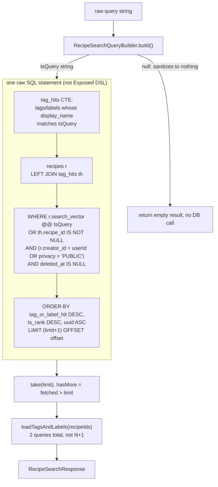

# Recipe Search

## Overview

`GET /api/v1/recipes/search` full-text searches recipes using Postgres's built-in text search
(`tsvector`/`tsquery`), not an external search service. It matches on recipe title/description
*or* on a matching tag/label display name, and ranks tag/label hits above plain-text relevance
matches.

- **Presentation** (`presentation/routes/RecipeSearchRoutes.kt`) — `GET /api/v1/recipes/search`,
  wrapped in the same `authenticate("auth-jwt")` block as every other protected route group (see
  `Routing.kt`).
- **Domain** (`domain/service/RecipeSearchService.kt`, `RecipeSearchQueryBuilder.kt`,
  `domain/repository/RecipeSearchRepository.kt`) — input clamping, tsquery construction, the
  repository interface. Zero framework dependencies.
- **Infrastructure** (`infrastructure/database/repositoryImpl/PostgresRecipeSearchRepository.kt`)
  — the only implementation; deliberately raw SQL rather than the Exposed DSL (see below).

## Request / Response

```
GET /api/v1/recipes/search?q=<text>&limit=<n>&offset=<n>
Authorization: Bearer <jwt>
```

| Param | Required | Default | Clamped to |
|---|---|---|---|
| `q` | yes — `400` if missing/blank | — | first 8 tokens, 40 chars each (see Query Sanitization) |
| `limit` | no | 20 | `1..50` |
| `offset` | no | 0 | `0..500` |

```json
{
  "query": "mac and cheese",
  "results": [
    {
      "uuid": "abc123",
      "title": "Baked Mac and Cheese",
      "description": "...",
      "imageUrl": "...",
      "imageUrlThumbnail": "...",
      "prepTimeMinutes": 15,
      "cookTimeMinutes": 30,
      "servings": 4,
      "creatorId": "user-uuid",
      "privacy": "PUBLIC",
      "updatedAt": 1700000000000,
      "tags": [{"uuid": "quick-uuid", "displayName": "Quick"}],
      "labels": [{"uuid": "veg-uuid", "displayName": "Vegetarian"}]
    }
  ],
  "hasMore": false
}
```

`RecipeSearchResultDto` has no default values on any field — `encodeDefaults = false` is set
globally, which would otherwise silently drop a field holding its default from the response JSON
and mask real client bugs.

## Query Sanitization

Raw user input never reaches `to_tsquery` directly — Postgres's tsquery syntax has its own
operators (`&`, `|`, `!`, `(`, `)`, `:`, `'`), so a bound parameter prevents SQL injection but
does nothing to stop `to_tsquery('english', "chef's salad")` from raising a syntax error.
`RecipeSearchQueryBuilder.build()` (`domain/service/RecipeSearchQueryBuilder.kt`) handles this:

1. Lowercase the input.
2. Split on any run of non-letter/non-digit characters (`\p{L}`/`\p{N}` — Unicode-aware, so
   accented and non-Latin scripts survive).
3. Drop blank tokens, truncate each to 40 chars, keep at most the first 8 tokens.
4. Join with `" & "`, suffixing every token with `:*` for prefix (as-you-type) matching.

`"chef's salad!!"` → `"chefs:* & salad:*"`. A query that sanitizes down to nothing (all
punctuation, or blank) returns `null`, and the caller **must** treat that as "zero results" —
calling `to_tsquery` with an empty string, or falling back to the raw input, both raise a Postgres
syntax error. `RecipeSearchService.search()` short-circuits on `null` before touching the
repository at all.

## Ranking & Matching



Ranking order: **tag/label name matches first** (`tag_or_label_hit DESC`), then plain-text
relevance (`ts_rank DESC`), then `uuid ASC` as a stable tiebreak so paging via `limit`/`offset`
never reorders already-seen rows between requests. `hasMore` is computed by fetching `limit + 1`
rows and checking whether more than `limit` came back — no separate `COUNT(*)` query.

Access control is baked into the same query, not a post-filter: `r.creator_id = userId OR
r.privacy = 'PUBLIC'`, same rule as everywhere else recipes are listed.

**Why raw SQL, not the Exposed DSL** (the usual house style — see `CLAUDE.md`): Exposed 0.56 has
no way to express `@@`/`to_tsquery`/`ts_rank`, and `search_vector` isn't a declared Exposed column
on `RecipeTable` for the DSL to build an expression against in the first place. The raw-SQL
`exec()` call needs `explicitStatementType = StatementType.SELECT` because the statement starts
with `WITH` (a CTE), which `exec()`'s keyword-based inference doesn't recognize — without it, the
call is routed through `executeUpdate()` instead of `executeQuery()`, which PgJDBC rejects for a
statement returning a `ResultSet` (see the comment in
`PostgresRecipeSearchRepository.kt` — confirmed by decompiling `exposed-core-0.56.0`).

## Rate Limiting

30 requests / 10 seconds per authenticated user (`RECIPE_SEARCH_RATE_LIMIT_NAME`, registered in
`Routing.kt`), keyed by `call.userId`. Unlike the image-upload rate limit, this one is a hardcoded
constant, not read from `application.yaml`.

## Testing

| Layer | File |
|---|---|
| Query sanitization | `RecipeSearchQueryBuilderTest.kt` |
| Service unit tests | (mocked `RecipeSearchRepository`, see `FakeRecipeSearchRepository.kt`) |
| Route integration | `RecipeSearchRoutesIntegrationTest.kt` |
| Real-Postgres integration | `PostgresRecipeSearchRepositoryIntegrationTest.kt` (`@Tag("db-integration")`) — the only layer that exercises the actual `tsvector`/`to_tsquery`/`ts_rank` SQL |
