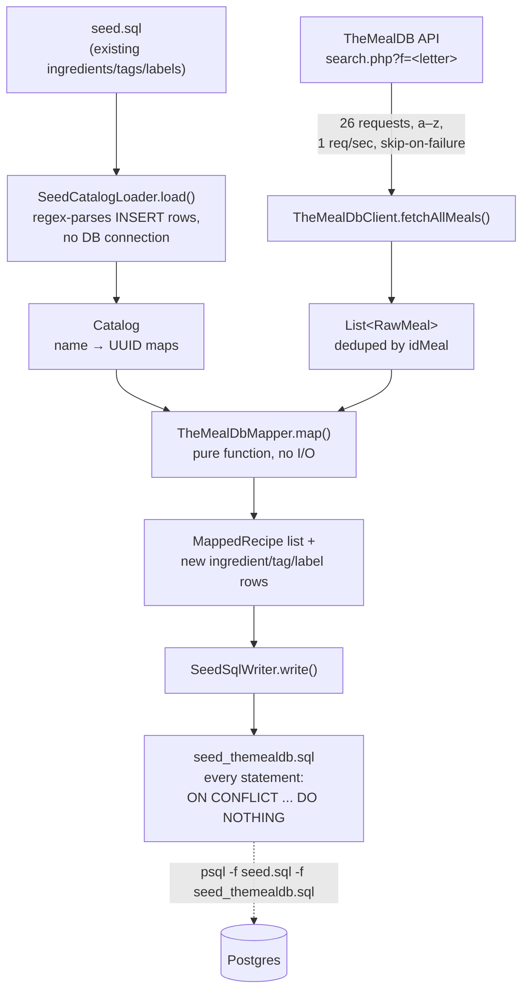

# TheMealDB Importer (`tools/themealdb`)

## What this is

A one-off Gradle CLI tool — **not part of the running server** — that fetches
[TheMealDB](https://www.themealdb.com/api.php)'s public recipe catalog, maps it onto this repo's
schema, and writes an idempotent SQL seed file. It exists to solve a cold-start problem: a fresh
database has almost no recipes, and meal-plan generation needs a real catalog to rank against. See
[`docs/meal-plan-roadmap.md`](meal-plan-roadmap.md) (Phase 1) for the product rationale, including
why this was chosen over scraping recipe blogs (TheMealDB is a licensed, explicitly-reusable API;
scraping sites like budgetbytes.com is technically easy but their ToS prohibits it — see that
doc's discussion of `adr-010`). This page covers only the tool's own mechanics.

```
./gradlew importTheMealDb
```

Requires outbound HTTPS to `www.themealdb.com` and takes no DB connection — it only reads
`src/main/resources/seed.sql` (to dedupe against the existing catalog) and writes
`src/main/resources/sql/seed_themealdb.sql`. Some sandboxed/restricted-egress environments block
that host by policy; if every letter fetch fails, that's almost certainly why.

Apply the output the same way as the other seed scripts:

```bash
psql -h localhost -U postgres -d chefai_db \
  -f src/main/resources/sql/seed.sql \
  -f src/main/resources/sql/seed_themealdb.sql
```

## Pipeline



### 1. Fetch — `TheMealDbClient`

`search.php?f=<letter>` (the shared free test key, `"1"`) is the only endpoint used. Unlike
`filter.php`, it returns *full* meal objects — ingredients, measures, instructions — in one call,
so a 26-letter a–z scan reaches the whole catalog without a per-meal follow-up `lookup.php`
request. Requests are spaced 1 second apart as a courtesy, even though the test key has no
enforced rate limit. A failed letter is logged and skipped, not fatal — the run continues with
whatever the other 25 letters returned. Results are deduplicated by `idMeal` (`LinkedHashMap`,
first-seen wins) since some meals appear under more than one letter.

### 2. Load existing catalog — `SeedCatalogLoader`

Resolving "is this ingredient already seeded" needs the existing catalog, but this tool
deliberately never opens a DB connection — so it regex-parses `INSERT INTO {ingredients,tags,
labels} (...) VALUES (...)` rows straight out of `seed.sql` instead. This is a small
format-specific reader tuned to this repo's own consistent single-statement, one-tuple-per-line
INSERT style, not a general SQL parser — if `seed.sql`'s formatting changes shape, this needs
updating alongside it.

### 3. Map — `TheMealDbMapper`

A pure function (`meals, catalog, importedAtMillis -> MappingResult`), unit-tested against a
checked-in fixture rather than live network calls. It resolves against three problems TheMealDB's
wire format doesn't solve for free:

- **`prep_time_minutes`/`cook_time_minutes`/`servings` are `NOT NULL`, but TheMealDB provides
  none of the three.** `estimateTimingsAndServings()` derives bounded heuristic values from step
  count, instruction length, and ingredient count (`prep` 5–25 min, `cook` 10–90 min, `servings`
  2/4/6 by ingredient-count tier) — explicitly estimates, not sourced facts, chosen so meal-plan
  generation's `maxPrepTimeMinutes` filter actually discriminates between recipes instead of every
  import landing on identical values.
- **`recipe_ingredients.quantity`/`unit` are `NOT NULL`, but TheMealDB gives free-text measures**
  like `"300g"`, `"1/2 cup"`, `"Dash"`. `parseMeasure()` handles fused amounts (`300g` →
  `300.0` / `"g"`, only splitting when the suffix is a known unit — a product name like `"7up"`
  is left alone), unicode vulgar fractions (`½` → `0.5`), mixed numbers, ranges (`"2-3"` takes the
  low end), and a free-text fallback (`"Dash"` → `1.0` / `"Dash"`) so a wrong-but-present unit
  always beats a crashed import.
- **Ingredients/tags/labels resolve by UUID against the shared catalog, never auto-created by the
  normal write path.** `resolveIngredient`/`resolveTag`/`resolveLabel` check the loaded `Catalog`
  first, and mint a new deterministic UUID only for names genuinely unseen — resolution is stateful
  *within one `map()` call*, so the same new name appearing across multiple meals in this batch
  correctly resolves to one new row, not several duplicates.

Other mapping decisions: `strArea` and non-dietary `strCategory` become tags; `strCategory`
values in `{vegan, vegetarian}` become labels instead (dietary vocabulary lives in `LabelTable`,
not `TagTable` — see the Phase 1 bug this convention was fixing, in
`docs/meal-plan-roadmap.md`); `splitInstructions()` splits on newlines first, then falls back to
sentence boundaries for a single long unstructured blob so one recipe doesn't become one
wall-of-text step; a meal listing the same ingredient twice merges into one
`recipe_ingredients` row (summing quantity when units match, else keeping the first-seen amount) —
required because `recipe_ingredients` has `PRIMARY KEY (recipe_id, ingredient_id)`.

**Deterministic, not random, UUIDs** — `recipeUuidFor`/`stepUuidFor`/`ingredientUuidFor`/etc. are
pure functions of TheMealDB's `idMeal` or a normalized name (`UUID.nameUUIDFromBytes`, or a
padded literal for recipes: `b0000000-0000-0000-0000-<idMeal padded to 12 digits>`, continuing
`seed.sql`'s readable-prefix convention). Re-running the importer against an unchanged upstream
catalog regenerates byte-identical UUIDs, so the emitted SQL diffs cleanly and repeat `psql`
applies hit `ON CONFLICT` instead of minting duplicates.

### 4. Write — `SeedSqlWriter`

Emits one SQL file, every statement `ON CONFLICT ... DO NOTHING`, in FK-safe order: the fixed
system "editorial" creator user (`SYSTEM_CREATOR_ID`, never a real test user) → new
ingredient/tag/label catalog rows → recipes → steps/recipe_ingredients/recipe_tags/recipe_labels.
`recipe_external_url` carries attribution (the meal's own source URL if TheMealDB provided one,
else a generated `themealdb.com/meal/{idMeal}` link) — required, since TheMealDB's terms ask for
attribution on reused content.

## Running it again

`./gradlew importTheMealDb` re-fetches fresh from TheMealDB every time and **overwrites**
`seed_themealdb.sql` in place — it's not additive across runs. Applying the (re)generated file via
`psql` is safe to repeat: deterministic UUIDs mean every insert either matches an existing row
(skipped by `DO NOTHING`) or is genuinely new. The one nuance: `DO NOTHING` is not `DO UPDATE` — if
a recipe's content changes upstream on TheMealDB between two runs, the already-imported row is
**not** refreshed; the first import silently wins because its insert for that UUID gets skipped on
conflict. Picking up an upstream change requires deleting the existing row(s) first, or a future
enhancement switching that path to `DO UPDATE`.

## Testing

Fully unit-tested, no network in tests — the mapper's pure-function design is what makes this
possible:

| File | Covers |
|---|---|
| `TheMealDbMapperTest.kt` | Measure parsing, instruction splitting, timing/servings heuristic, catalog resolution/reuse, deterministic UUID stability |
| `SeedCatalogLoaderTest.kt` | Regex-based `seed.sql` parsing against fixture text |
| `SeedSqlWriterTest.kt` | SQL escaping, statement ordering, idempotency shape |

`TheMealDbClient` itself has no unit tests (it's a thin HTTP wrapper around a live third-party
API) — its behavior is exercised manually by actually running `importTheMealDb`.

## Two real bugs this importer surfaced

Building and running this against a live Postgres instance found two pre-existing bugs, fixed as
part of the same work (see `docs/meal-plan-roadmap.md`'s Phase 1 for full detail):

1. **Recipe privacy casing** — `seed.sql` wrote lowercase `'public'`/`'private'` for the original
   70 recipes, but every query that matters filters `privacy = 'PUBLIC'` exactly, and
   `enumValueOf(dao.privacy)` throws on lowercase input. Fixed in `seed.sql`; a standalone
   `fix_privacy_casing.sql` migration exists for databases seeded before the fix.
2. **Dietary restrictions were a silent no-op** — meal-plan filtering resolved
   `dietaryRestrictionTags` against `TagTable` (rows like `Spicy`/`Breakfast`), but the dietary
   vocabulary actually lives in `LabelTable`. No tag ever matched, so the filter silently returned
   every recipe regardless of requested diet. Fixed in
   `PostgresSyncRepository.findCandidateRecipeIds`.
